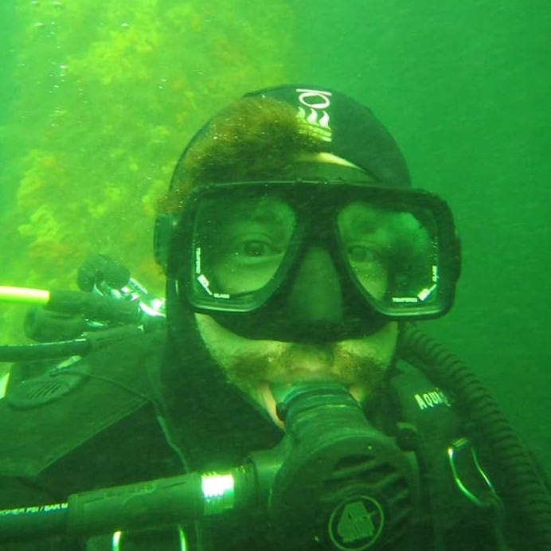

Brandon O'Brien is a human druid from the far away land of Long Island. He studies marine algae, hoping to find out the secrets of the invasive red alga [_Dasysiphonia japonica_](dasy.html). Brandon is most at home on the rocky coast, splashing around in tidepools and digging into piles of rockweed. Some say that he cares more about his plants than about people. This may be true.  
In his spare time he enjoys woodcarving, reading, and staring forlornly out to sea.
---

__Stats:__

_Class_: Druid
_Alignment_: Chaotic Neutral
_Level_: 28

|Table| table |
| --- | --- |
| Strength     | 7 |
| Dexterity    | 11 |
| Constitution | 10 |
| Intelligence | 15 |
| Wisdom | 14 |
| Charisma | 8 |

