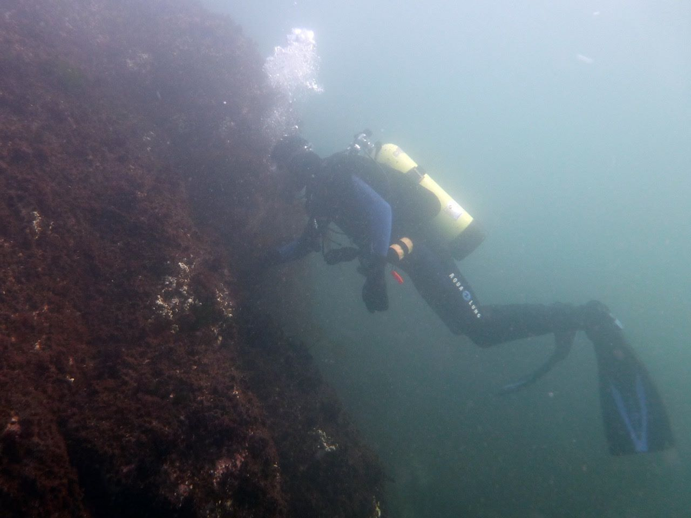

Hello! This is my very professional website.

My name is Brandon O'Brien. I am a PhD candidate at the University of New Hampshire. My research is focused on marine seaweeds, speciefically invasive ones. I am particularly interested in [_Dasysiphonia japonica_](dasy.html), a red alga from Japan. I am looking at the ecology, biology, and biogeography of _Dasysiphonia_ using a combination of field, lab, and modeling studies. 

